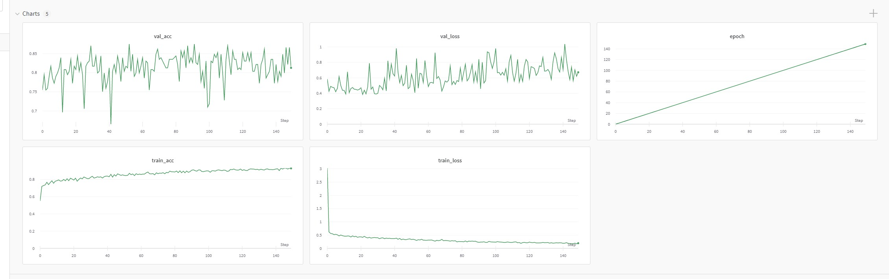

# 0411會議紀錄

# 上週完成的進度

- 已取得另一組照片155張
- 組內已搜集完500多張照片（250抽菸、250非抽菸）
- 利用卷煙資料庫試跑結果：準確度51%(?)，跟瞎猜沒兩樣哈哈哈

訓練（模型自己去跑）、驗證（驗證模型）、測試（最後的結果）

val_acc：驗證模型的準確率，精准度，越高越好

val_loss：損失函數，越趨近零越好

train：訓練過程中那筆訓練資料的狀況

在val裡，acc和loss的震盪非常嚴重，理想的情況是要漸漸趨近於一條線

目前情況：val_acc低70高80，如果是完全新的資料概率大概50%（只認得出來自己訓練的資料的情況）

- facenet
- Lapetus：[https://www.lapetussolutions.com](https://www.lapetussolutions.com/)
    - 眼睛要睜大、解析度、五官深邃抽菸機率較比較高？、認定有抽菸機率都不會低於50？、比較黑的抽菸機率高？、嘴巴張開都不給過
    - BMI和年齡蠻準、但抽菸不準(?)
    - 準確度不太夠
    - 為什麼要強制有張嘴的不給分析？為了量BMI？

    

- 抽菸臉部辨識論文

    [Automated_Assessment_of_Facial_Wrinkling_a_case_st.pdf](https://s3-us-west-2.amazonaws.com/secure.notion-static.com/756db8de-3e9c-44be-9f5a-277aa85883e4/Automated_Assessment_of_Facial_Wrinkling_a_case_st.pdf)

    - 抽菸影響皺紋
    - 不用訓練、用單一皮膚看是否抽過抽菸者的平均密度
    - 統計研究
    - 研究為針對西方人所做，可能會不準，自己跑統計樣本數可能又會不夠

# 目前想法

- 比起提升準確度等，可能走完整度、條款設計，會比較好？
- 走論文得皺紋分析？擔心資料不能用

# 本週要做的事情

- 要拿到另一組完整的500張照片（欣儒）
- 與業師約五月第一週的時間（欣儒）
- 吸菸對於投保的影響、對臉部特徵的影響（以臻、欣儒）
- 繼續找國內外人臉辨識公司（以臻、欣儒）
- 用拿到的1000張照片跑看看分類（宜儒、沛璇）
- 研究皺紋（東儒）

# 下次開會時間

4/28 8:00PM

- 討論與業師開會綱要
